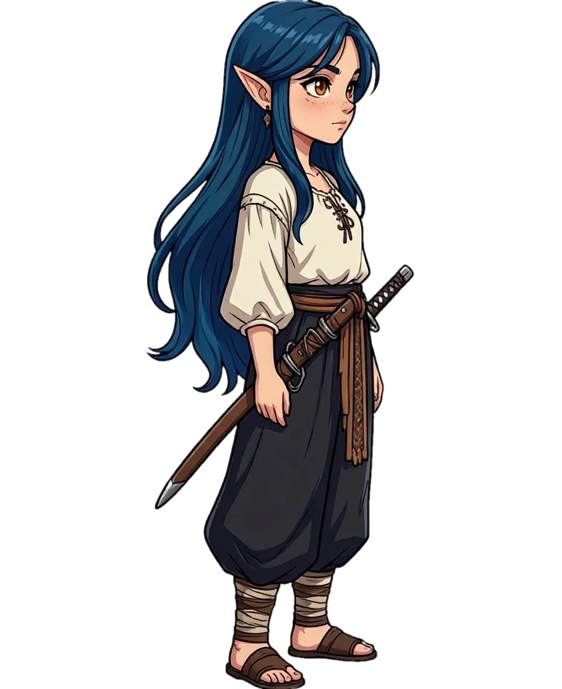
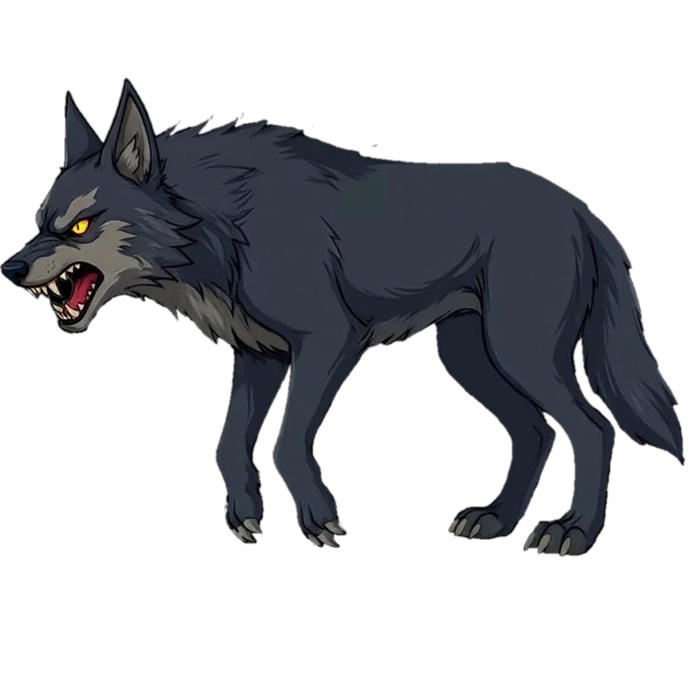
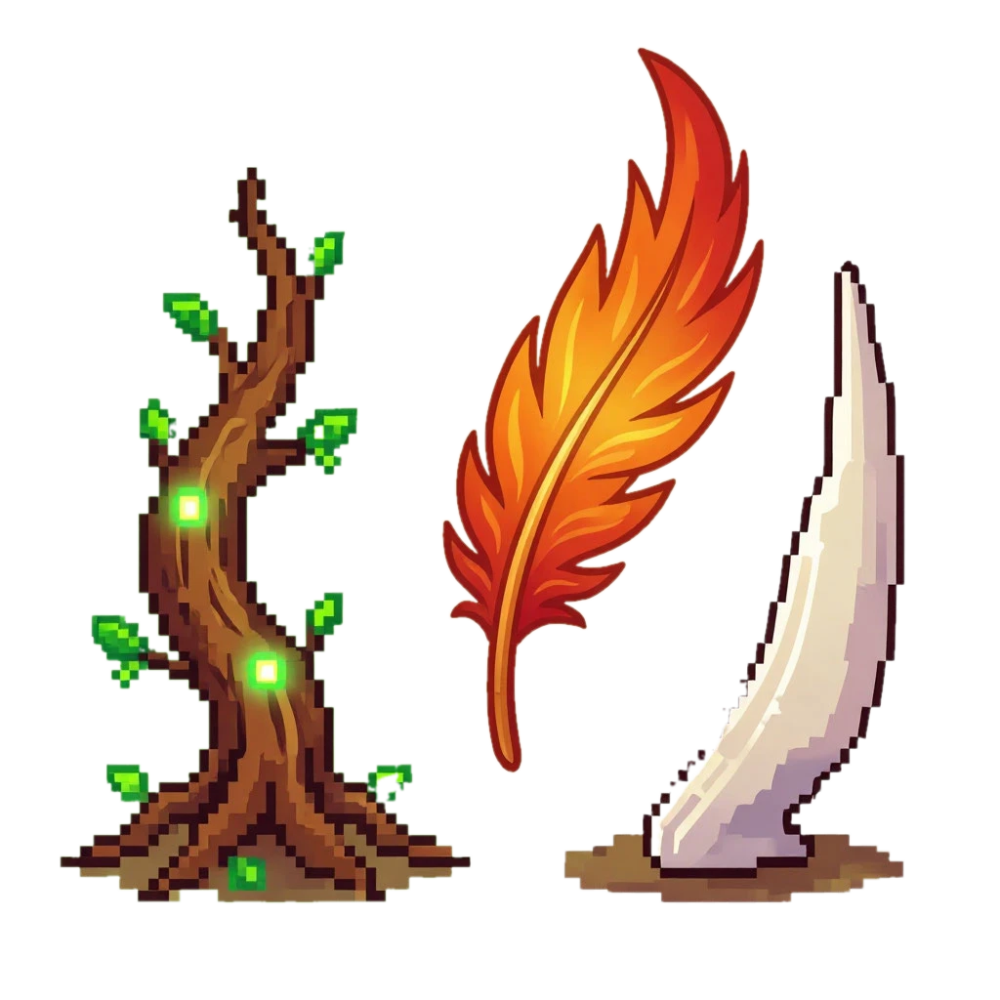
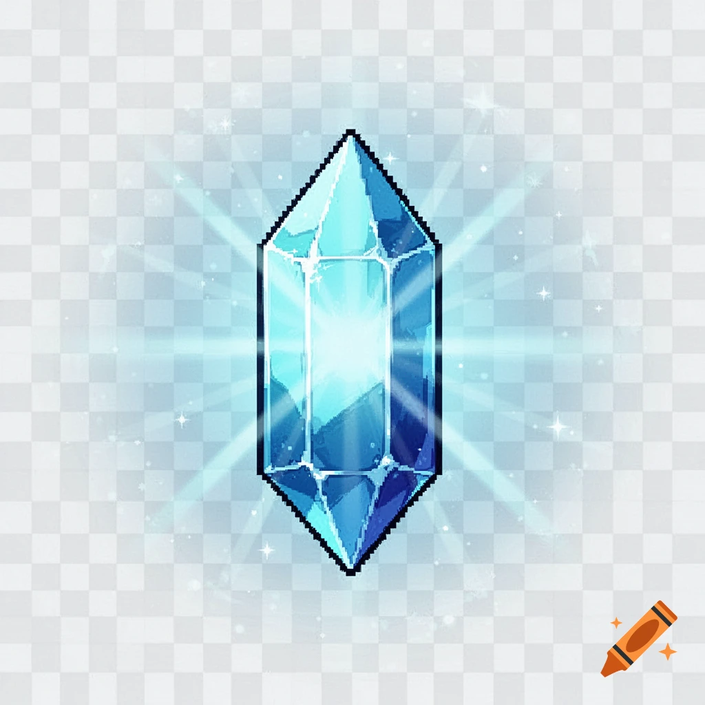
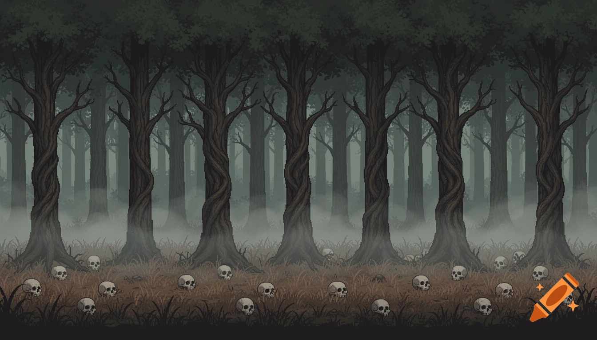
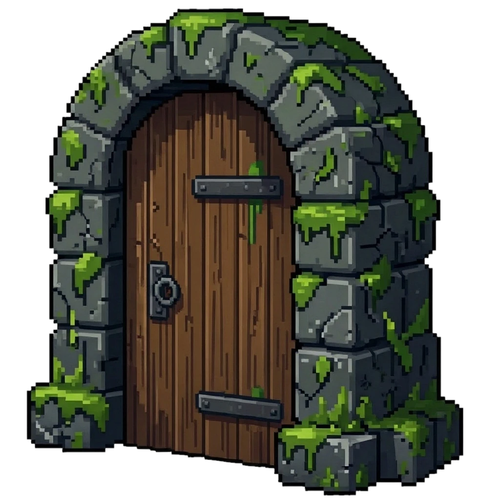

# Пакет разработки игры

## 1. Краткий бриф

**Название:** Навь

**Жанр и камера:** 2D экшен-квест с элементами побега и головоломок, вид сбоку.

**Одно предложение:** Игрок управляет героем, который попал в мир мёртвых (Навь), чтобы выбраться обратно, но ему мешают персонажи из славянской мифологии, а открыть выход можно только собрав ритуальный оберег.

**Платформа:** Браузер / ПК

**Экран:** 16:9 (горизонтальный).

**Управление:** Клавиши WASD или стрелки для движения, мышь для взаимодействия с предметами и кнопками.

**Игровая цель:**
Игрок понимает, что выиграл, когда собирает все 3 части оберега, применяет их у запертого прохода, и тот открывается, выводя героя на следующий уровень.

**Сеттинг и тон:**
действие происходит в Сумрачном лесу - тёмном, таинственном лесу с полянами, озером и дремучей чащей; атмосфера мрачная, местами жуткая; в мире действует правило: чтобы открыть магический проход, нужны ритуальный оберег и магическая энергия (кристаллы), а Леший помогает, но только за плату.

## 2. MVP

**Гипотеза:**
Мы проверяем, что игроку интересно исследовать лес, собирать части оберега и кристаллы, решать тратить кристаллы на подсказку или копить на проход, сражаться или обманывать нечисть.

**Входит:**
1 сцена (Сумрачный лес), 2 героя на выбор (девушка или парень), 1 ресурс (кристаллы), 3 части оберега (корень, перо, коготь), 1 NPC (Леший), 3 препятствия/врага (оборотень, русалка, запутанные тропы), победа (открыт проход) и поражение (недостаточно кристаллов для открытия прохода, возврат на уровень).

**Не входит:**
Магазин оружия, боевая система с монстрами, уровни с упырями, Горынычем и Мореной, мультиплеер, сложная экономика, прокачка персонажа, скины, большой сюжет.

**Критерий успеха:**
MVP успешен, если игрок без подсказки понимает, что нужно собрать 3 части оберега и кристаллы для открытия прохода, выполняет все шаги за 20-30 минут, не запутавшись в тропах, и в конце говорит, что хочет пройти следующий уровень, потому что ему интересно, что будет дальше.

## 3. Аудитория и референсы

**Возраст:** 10-13

**Опыт:** средний

**Устройство:** ПК/ноутбук

**Что понравится:**
Атмосфера, загадки, анимация, рисовка, сюжет, нечисть

**Что раздражает:**
Сложные загадки, однообразное оружие, легкие победы или наоборот слишком сложные, скучные награды.

| Референс | Что изучаем | Что берём | Чем отличаемся |
| --- | --- | --- | --- |
| Folk Hero | тематика славянских персонажей, постоянные сражения. | внешний вид игры | сюжетом. |
| Василиса и Баба Яга | тематика славянских персонажей, есть сражения, решение загадок | некоторые  моменты сюжета | анимацией и графикой, упором на персонажей из славянской мифологии, а не из сказок. |

## 4. UX, сцены и макет

**Макет:** https://www.figma.com/design/YtGJnOI89qHrzBjbgQ7teW/Untitled?node-id=0-1&t=oigRp7tXnmpIJFYN-1

**Схема механик:** https://viewer.diagrams.net/?tags=%7B%7D&lightbox=1&highlight=0000ff&edit=_blank&layers=1&nav=1&dark=auto#R%3Cmxfile%3E%3Cdiagram%20name%3D%22%D0%A1%D1%82%D1%80%D0%B0%D0%BD%D0%B8%D1%86%D0%B0-1%22%20id%3D%228iAh9ln72PG3Hd_Kgnfz%22%3E3ZtLj6M4EIB%2FTaTdw7SwzfOYhHT3atWjlvqwPacVCt4EiYQMIZNkfv2ah8E2SXgEO8xckF0xBqr8VbmKMEHzzekl9nbrt8jH4QRq%2FmmC3AmElqWTYyo45wIdwVywigM%2FF4FK8BH8xIVQK6SHwMd7bmASRWES7HjhMtpu8TLhZF4cR0d%2B2H9RyF91561wTfCx9MK69J%2FAT9a51IZWJX%2FFwWpNrwxMJ%2F9l49HBxZPs154fHRkRWkzQPI6iJG9tTnMcprqjesnPe77ya3ljMd4mrU44GvrbHsOZD96%2BfX3V%2F0ah9eXCLIVon5ypDsg8RN2kMzuugwR%2F7Lxl%2BsuRGJzI1skmJD1AmvmZP7zwUJw5cbXJFEzIj3bWnmlZW2Mki%2BzItg0yR9aYF9306GanLIor4DjBJ%2BZ2iyd%2BwdEGJ%2FGZDFkzRjEKCxwrAwLNzGV0FrsYc%2BaXn1csn1U5c6Vh0iiUfFnh8%2Bjl49U5fPnpLv76%2Bu%2F753Lja1Th2K8tu5sW2PrTdDGT3jL09vtgySs%2Bjg5bH6fX1UozJF68wsmNW4F1c7VWZYxDLwl%2B8M%2FA6Ne4ob%2FsCuRxvDMzYBcF22TP3MB7KqgMBBFvIFMTTJFP2Onk8uL76BAvcXESi1DDPI4wT67y2jzZQikV2n%2FtwDZLpVoKoCewjktRJUeTac9SMKH5%2FZC6rFk21M5%2BQJTqknCYHefM6D7g6hfABRYProVummQwcNF4wNV%2FZXABuodcevbd6ALRB0hmV1fEbg5eBucM0KCawVkE1WcaVMs4DJjYewn9ocilG6GS3AaLDIauoQzdxyDZuNihNhA1UMRPMjWmGmpmAjVsMKNxr4hzLDslXM%2BDMYJuM1LT%2F2CMWL85I9fD1vXFT5M8qny61ehMkTARErMLyRTZimJPfTPIJncaRaWMOuRo8ineoPEGGTxLpvFk3LbDYDQ5HWjKFlGz9XpTh09B8pm2n3RkF%2F1vWd8xiq57Ysa6Z6bzjuOAqATH3XaoVLFjY%2F0an%2Fy60EGXLSoSYqTed4taLkfhNlS5CXq5x%2BaX1R419xN5zLWKdh%2FfcKn8A%2Fg4W%2FoP6hlsWZ4BdCkANbkG%2BhR3%2BwbA%2BYXbbqGtC4DjdAHX8RNKgKhvlQg5AseaoZZjVXWii5jmIVz7I5PmpE9rO2r3T1kk16woj%2BQuFaFGkuGISR5pvUk%2ByYYY2sU8WjbJiqpGF8s%2BYkQWNvU6054xJ9p8%2FVcO5QZQRnmX4lEj5frDKB9JZWowNE3jwUFWVWnqgUn1JRCFIq5oBokgdqlQPTCnNi1pSbU9zjjcMqm27nnvU8uFW9feRD9hKQ7hSopvJfrsJtti%2FMeMGfNMg7rN59sLpsZtF6VwRfm2rktzG446%2FZc6XDAvEpyaM7b5f7nQwVd3WkIEyF9UkGM5j6RMylJlIxpThtljOQP5dgmZFH2IsXnw65mUuAZgTzdsQGEixa%2Ff273OUpFJwdo7RJcWUJi8ifPWknIoTRnfcEC%2B734L%2BevnUENBaYpR2FSbQ0GkCMqR51DKNkNQxT9hyETx%2BZPtMISl3QqxrNe1GumMC8am%2FKItjLrojkWqZcNoDuikZeXX4ElDqGd%2BPbZNV7u02TA6vYsWQoM5VNpsiA8qezWW31dIDg0L5lOEKZ9i3ah%2Fk7bB1cJl5cmiGaT9%2FwuN6P%2FN6KEvnOpQmYIR%2BtasddAwkWSoqF5lQzW9%2Btq32mNVm62OVRM3%2BzCorJ1cqGABZqR%2BR43EbN66iUG7D5%2BkW30Elpu6%2BpIOLf4H%3C%2Fdiagram%3E%3C%2Fmxfile%3E

| Сцена | Назначение | Что видит игрок | Действия игрока | Переходы |
| --- | --- | --- | --- | --- |
| Стартовое меню | Вход в игру | Название «Навь», тёмный лес на фоне, кнопка «Играть», кнопка «Настройки» | Нажать «Играть» (начать игру), нажать «Настройки» (звук/язык) | Играть → экран выбора персонажа |
| Экран выбора персонажа | Выбор героя | Название «Навь», тёмный лес на фоне, кнопка «Играть», кнопка «Настройки» | Выбрать девушку или парня, нажать «Выбрать» | Выбрал → игровая сцена (Сумрачный лес) |
| Игровая сцена (Сумрачный лес) | Основная механика (сбор оберега и кристаллов, открытие прохода) | Лес, герой, 3 части оберега (разбросаны по карте), 10 кристаллов, Леший у озера, тайный проход (закрытый) справа, сверху счётчик кристаллов и иконки оберега | Двигаться (WASD/стрелки), подбирать кристаллы и предметы, подходить к Лешему и нажимать «Купить подсказку», подходить к проходу и нажимать «Применить оберег» | Собрал оберег + кристалл и открыл проход → победа. Нажал паузу → пауза. Не хватило кристаллов → сообщение об ошибке |
| Пауза | Остановка игры | Затемнение экрана, кнопки: «Продолжить», «Настройки», «Выйти в меню» | Нажать «Продолжить» (вернуться в игру), «Настройки» (звук/язык), «Выйти в меню» | Продолжить → игровая сцена. Выйти в меню → стартовое меню |
| Победа | Фиксация успеха | Сообщение «Выход открыт! Ты победил!», количество собранных кристаллов, кнопка «Дальше» | Нажать «Дальше» (перейти на следующий уровень) или «В меню» | Дальше → заглушка «Скоро новые уровни». В меню → стартовое меню |
| Поражение / ошибка | Фиксация ошибки (не хватило кристаллов или оберега, или проиграл битву) | Сообщение «Нужны все части оберега» или «Нужен 1 кристалл», « Ты проиграл, но не сдавайся!», кнопка «Вернуться» | Нажать «Вернуться» (вернуться на уровень и дособирать) | Вернуться → игровая сцена |

**Первые 30 секунд:**
Игрок видит тёмный лес, в центре или слева стоит его герой (девушка или парень), на экране есть счётчик кристаллов (пока 0) и три серые иконки частей оберега. Игрок понимает, что нужно двигаться (WASD или стрелки), находит рядом яркий голубой кристалл, подходит к нему, наступает на него, кристалл исчезает, а счётчик кристаллов становится равен 1. Игрок делает вывод, что кристаллы собирать полезно, и начинает исследовать лес дальше, чтобы найти другие предметы.

### Скриншоты сцен


## 5. Механики и состояния

**Основной цикл:**
Игрок исследует Сумрачный лес → находит и собирает кристаллы и части оберега → подходит к Лешему и решает: потратить 3 кристалла на подсказку или копить на проход → собирает все 3 части оберега → подходит к тайному выходу → проверяет: есть ли все части и несколько кристаллов → если да, то открывает проход и переходит дальше, если нет, то видит сообщение и продолжает искать.

| Механика | Событие | Условие | Что меняется | Результат для игрока |
| --- | --- | --- | --- | --- |
| Подсказка Лешего | Игрок нажимает «Купить подсказку» | Есть 3 кристалла и подсказка не использована | Кристаллы -3, подсказка = true | На карте появляется маркер с ближайшей частью оберега |
| Открытие прохода | Игрок нажимает «Применить оберег» у выхода | Все 3 части собраны, есть минимум 1 кристалл, проход закрыт | Оберег исчезает, кристаллы -1, проход = open | Появляется сообщение «Выход открыт!», игрок переходит на следующий уровень |
| Сбор оберега | Игрок нажимает «Подобрать» у части оберега | Часть ещё не собрана | Часть становится true, счётчик оберега +1 | Игрок видит обновлённые иконки (1/3, 2/3, 3/3) |
| Сбор кристаллов | Игрок подходит к кристаллу и нажимает «Подобрать» | Кристалл ещё не собран | Кристаллы +1 | Счётчик кристаллов обновляется |

**Главная механика:**
Сбор оберега, потому что это основа всего уровня - без неё игрок не может открыть проход, а значит, не может пройти игру; эта механика простая, понятная и сразу показывает игроку цель.

**gameState:**
menu - на стартовом экране можно выбрать персонажа и начать игру; play - игрок двигается, собирает предметы и взаимодействует с NPC; pause - игра остановлена, можно продолжить или выйти в меню; win - проход открыт, показано сообщение о победе и кнопка «Дальше»; lose - игрок не смог открыть проход (не хватило кристаллов), показано сообщение об ошибке и кнопка «Вернуться».

## 6. Ассеты и визуальный стиль

| Ассет | Сцена | Зачем нужен | MVP? | Статус | Описание / промт | Файл |
| --- | --- | --- | --- | --- | --- | --- |
| Яролика (главная героиня) | Игровая сцена, меню | Главный персонаж, которым управляет игрок | Да | Нужен | 2D side-view, девушка с синими волосами и карими глазами, в широкой рубашке и шароварах, вид сбоку, стоит лицом вправо, пиксельный стиль, прозрачный фон |  |
| Святозар (главный герой) | Игровая сцена, меню | Главный персонаж, которым управляет игрок | Да | Нужен | 2D side-view, парень со светлыми кудрявыми волосами и зелёными глазами, в голубой рубашке и чёрных шароварах, вид сбоку, стоит лицом вправо, пиксельный стиль, прозрачный фон |  |
| Леший | Игровая сцена | Даёт подсказки и мешает игроку | Да | Нужен | 2D side-view, маленький хитрый старичок в лохмотьях из листьев и мха, с хитрой улыбкой и прищуренными глазами, стоит, прозрачный фон |  |
| Русалка | Игровая сцена | Враг, который пугает и мешает | Да | Нужен | 2D side-view, русалка с зелёными волосами, в лохмотьях, сидит, смотрит прямо, жуткая |  |
| Оборотень | Игровая сцена | Враг, который пугает | Да | Нужен | 2D side-view, волк на четырёх лапах, тёмная шерсть, жёлтые глаза, оскал, стоит, прозрачный фон |  |
| Части оберега | Игровая сцена (лежит на карте) и UI | Предметы для сбора и открытия прохода (корень, перо, коготь) | Да | Нужен | Три иконки на прозрачном фоне: корень с зелёными листьями, перо оранжево-красное, коготь белый длинный |  |
| Кристаллы | Игровая сцена (лежит на карте) и UI (счётчик) | Валюта | Да | Нужен | Иконка голубо-синего кристалла, светится, на прозрачном фоне |  |
| Фон (Сумрачный лес) | Игровая сцена (фон) | Картинка заднего плана | Да | Нужен | Горизонтальный 2D-фон, тёмно-зелёный лес, деревья, трава, черепа на земле, без глубины, вид сбоку |  |
| UI-элементы | Все сцены (поверх игры) | то, что на карте. | Да | Нужен | иконки жизни, карта, порталы |  |
| Тайный проход (закрытый) | Игровая сцена (на карте) | Препятствие, которое надо открыть | Да | Нужен | Каменная арка с дверью, оплетена зелёными лианами и мхом, тёмная, без свечения |  |
| Тайный проход (открытый) | Игровая сцена (после открытия) | Финиш уровня | Да | Нужен | Каменная арка с дверью, оплетена зелёными лианами и мхом, тёмная, с свечением |  |

**Стиль:**
cartoon fantasy, readable silhouettes, soft light.

**Палитра:**
тёмные приглушённые цвета (тёмно-зелёный, серый, коричневый, тёмно-синий) с яркими акцентами (голубой для кристаллов, фиолетовый для портала, белый для когтя), мрачная сказочная атмосфера, таинственная и слегка жуткая.

**Читаемость:**
герой отделяется от фона за счёт ярких контуров, важные предметы (кристаллы, части оберега, портал) контрастные и заметные, UI (кнопки и счётчики) не сливается с фоном, имеет обводку или подложку.

## 7. Данные, псевдокод и код

| Переменная | Тип | Начальное значение | Когда меняется | Зачем нужна |
| --- | --- | --- | --- | --- |
| crystals | число | 0 | при сборе кристалла | чтобы считать, сколько кристаллов у игрока |
| amulet_parts | список | [false, false, false] | когда игрок подбирает часть оберега | чтобы знать, какие части уже собраны (корень, перо, коготь) |
| passage_open | флаг | false | когда игрок применил оберег и заплатил кристалл | чтобы открыть проход и завершить уровень |
| game_state | строка | 'menu' | при переходах между экранами | чтобы игра знала, что сейчас делать: меню, игра, победа |

### Псевдокод

```text
Если игра в состоянии 'play':
    Если игрок нажал на часть оберега:
        Если эта часть ещё не собрана:
            Отметить часть как собранную
            Показать сообщение: "Часть собрана!"
            Если все 3 части собраны:
                Показать сообщение: "Ты собрал весь оберег!"
        Иначе:
            Показать сообщение: "Ты уже собрал эту часть"

    Если игрок нажал на выход и все 3 части собраны:
        Если у игрока есть хотя бы 1 кристалл:
            Забрать 1 кристалл
            Открыть проход
            Показать сообщение: "Выход открыт! Ты победил!"
            Переключить состояние игры на 'win'
        Иначе:
            Показать сообщение: "Нужен 1 кристалл, чтобы открыть проход!"
```

**Функции-обёртки:**
showMessage(), isAmuletComplete()

**Язык:** JavaScript

**Где проверяли:** браузер

```javascript
let crystals = 0;
let amuletParts = [false, false, false];
let passageOpen = false;
let gameState = 'menu';

function showMessage(text) {
    alert(text);
}

function isAmuletComplete() {
    return amuletParts[0] && amuletParts[1] && amuletParts[2];
}

function pickUpAmulet(partIndex) {
    if (gameState !== 'play') return;
    if (amuletParts[partIndex]) {
        showMessage('Ты уже собрал эту часть!');
        return;
    }
    amuletParts[partIndex] = true;
    showMessage('Часть собрана!');
    if (isAmuletComplete()) {
        showMessage('Ты собрал весь оберег! Теперь найди выход.');
    }
}

function openPassage() {
    if (gameState !== 'play') return;
    if (passageOpen) {
        showMessage('Выход уже открыт!');
        return;
    }
    if (!isAmuletComplete()) {
        showMessage('Сначала собери все 3 части оберега!');
        return;
    }
    if (crystals < 1) {
        showMessage('Нужен 1 кристалл, чтобы открыть проход! Найди его в лесу.');
        return;
    }
    crystals = crystals - 1;
    passageOpen = true;
    gameState = 'win';
    showMessage('Выход открыт! Ты победил!');
}
```

## 8. Тесты и риски

| Тест | Входные данные | Действие | Ожидаемый результат | Факт | Статус |
| --- | --- | --- | --- | --- | --- |
| Успешный сбор части оберега | amuletParts = [false, false, false], gameState = 'play' | Игрок нажимает на часть оберега (индекс 0) | Часть становится true, появляется сообщение «Часть собрана!» | Часть стала true, сообщение появилось | Пройден |
| Сбор уже собранной части | amuletParts = [true, false, false], gameState = 'play' | Игрок нажимает на ту же часть оберега (индекс 0) | Часть не меняется, появляется сообщение «Ты уже собрал эту часть!» | Часть осталась true, сообщение появилось | Пройден |
| Сбор всего оберега | amuletParts = [true, true, false], gameState = 'play' | Игрок нажимает на последнюю часть | Все 3 части собраны, появляется сообщение «Ты собрал весь оберег!» | Все 3 части стали true, сообщение появилось | Пройден |
| Открытие прохода без оберега | amuletParts = [true, false, false], crystals = 1, gameState = 'play' | Игрок нажимает на выход | Появляется сообщение «Сначала собери все 3 части оберега!», проход не открывается | Проход не открылся, сообщение появилось | Пройден |
| Открытие прохода без кристаллов | amuletParts = [true, true, true], crystals = 0, gameState = 'play' | Игрок нажимает на выход | Появляется сообщение «Нужен 1 кристалл, чтобы открыть проход!», проход не открывается | Проход не открылся, сообщение появилось | Пройден |
| Успешное открытие прохода | amuletParts = [true, true, true], crystals = 1, gameState = 'play' | Игрок нажимает на выход | Кристаллы становятся 0, passageOpen = true, gameState = 'win', появляется сообщение «Выход открыт! Ты победил!» | Кристаллы стали 0, проход открыт, победа | Пройден |
| Открытие прохода повторно | passageOpen = true, gameState = 'play' | Игрок снова нажимает на выход | Появляется сообщение «Выход уже открыт!», ничего не меняется | Сообщение появилось, состояние не изменилось | Пройден |
| Сбор оберега на паузе | gameState = 'pause', amuletParts = [false, false, false] | Игрок нажимает на часть оберега | Ничего не происходит, сообщение не выводится | Ничего не произошло, сообщения нет | Пройден |

| Критическая точка | Что может сломаться | Защита в алгоритме | Как проверить |
| --- | --- | --- | --- |
| crystals = 0 | игрок не может открыть проход, но может застрять | проверять crystals >= 1 перед открытием, иначе показывать сообщение «Нужен 1 кристалл» | тест «Открытие прохода без кристаллов» |
| amuletParts = [true, true, true] | игрок может попытаться открыть проход повторно после победы | проверять passageOpen === false перед открытием | тест «Открытие прохода повторно» |
| amuletParts собираются повторно | одна часть может засчитаться дважды | проверять amuletParts[partIndex] === false перед сбором | тест «Сбор уже собранной части» |
| gameState = 'pause' | игрок может собирать предметы или открывать проход на паузе | проверять gameState === 'play' в начале каждой механики | тест «Сбор оберега на паузе» |
| passageOpen = true | проход открыт, но игрок всё ещё может тратить кристаллы или собирать оберег | проверять passageOpen === false в openPassage() и блокировать сбор после победы | тест «Повторное открытие прохода» |
| gameState = 'win' | игрок может продолжать собирать предметы после победы | менять gameState на win и блокировать все действия, кроме перезапуска | тест «Действия после победы» |

**Главный риск:**
Игрок может собрать все 3 части оберега, но не найти кристалл, потому что он спрятан слишком далеко или плохо виден - тогда игрок застрянет, не поймёт, что делать, и бросит игру. Чтобы избежать этого, нужно разместить кристалл на видном месте и добавить подсказку от Лешего, которая направляет игрока к кристаллу.

## 9. План реализации

План реализации показывает порядок сборки прототипа, ориентиры по срокам и критерии готовности. Это помогает не уходить в визуальные детали до того, как заработала главная механика.

| Этап | Что сделать | Ориентир по сроку / дедлайн | Готово, когда... |
| --- | --- | --- | --- |
| 1. Состояния игры | Создать состояния: menu (стартовый экран), play (игра), pause (пауза), win (победа), lose (поражение). Просто переключаться между ними без механик. | 30 минут | При нажатии кнопок экраны меняются: меню → игра → пауза → победа/поражение |
| 2. Управление | Добавить движение героя по лесу с помощью клавиш WASD или стрелок. Поставить границы, чтобы герой не уходил за экран. | 30–40 минут | Герой ходит по сцене, не выходит за границы экрана, не проваливается сквозь деревья |
| 3. Главная механика | Реализовать сбор 3 частей оберега + 1 кристалла и открытие прохода. Добавить проверки: что часть не собрана дважды, что есть кристалл, что проход не открыт. Показать сообщения об ошибках и успехе. | 1 занятие (1–1.5 часа) | Игрок может собрать оберег, найти кристалл, открыть проход и получить сообщение «Выход открыт!» или «Нужен кристалл» |
| 4. Победа и поражение | Добавить состояние win (проход открыт) и lose (не хватило кристаллов, проиграл битву). Сделать кнопку «Играть снова», которая возвращает в меню или перезапускает уровень. | 30 минут | После открытия прохода появляется экран победы, при ошибке — сообщение, игра корректно завершается и перезапускается |
| 5. Минимальный визуал | Добавить фон (лес), героя (спрайт), иконки кристалла и частей оберега, кнопки «Подобрать» и «Применить оберег». Всё читаемо и понятно. | 1 занятие (после логики) | Игрок видит лес, героя, счётчик кристаллов, иконки оберега и может понять, что нужно делать |
| 6. Тесты и баги | Проверить все тесты из карточки №8: сбор части, повторный сбор, открытие без оберега, открытие без кристалла, открытие на паузе, повторное открытие. Исправить баги. | 30–40 минут | Все тесты из таблицы пройдены, критические точки защищены, игра не ломается |

## 10. Сдача

**Комментарий:**
Сделала сцены, но желательно их развить.
